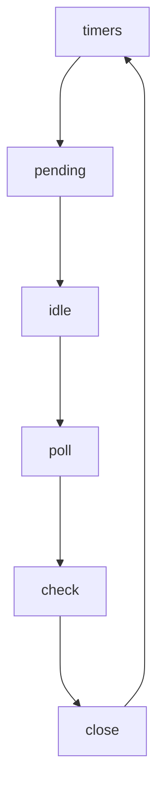

Перечислите фазы Event Loop в правильном порядке. На какой фазе выполняются setTimeout колбэки, а на какой — setImmediate?
```
setTimeout - выполняются на фазе timers'ов, 
а setImmediate на фазе check.
```

```
При этом *process.nextTick()* и *Promise* выполняются между любыми этапами.
```

Почему process.nextTick выполняется раньше, чем Promise.then? К какой категории (microtasks/macrotasks) они относятся?

```
Потому что process.nextTick имеет приоритет над Promise'ом . Они относятся к категории микротасок.
```

Что произойдёт, если в обработчике роута Fastify сделать синхронный тяжёлый цикл? Как это влияет на другие запросы?

```
Заблокируется поток управления и другой пользователь не сможет сделать новые запросы, пока не отработает тяжёлый цикл.
```

В чём разница между CommonJS (require) и ESM (import)? Как "type": "module" в package.json меняет поведение?

```
CommonJS отличается от ESM тем, что
cjs - загружается синхронно, а esm - асинхронно.
При этом всём в cjs можно использовать динамический импорт по типу
(async () => {const module = await import('some-cjs-file')})()
Также ESM в отличие от CommonJS - 
- не имеет module.exports|require|__dirname|__filename(но есть import.meta.url)
```
```
"type": "module" - включает esm.
```

Объясните принцип REST своими словами. Почему PUT /api/products/5 — это обновление, а POST /api/products — создание?

```
В REST мы работает с данными как с существительными над которыми мы выполняем какие-то действия (методы), например put/post-запросы.
put - это как прийти к конкретной ячейке 5, выкинуть из неё всё содержимое и положить туда новое.
post - это обратиться к списку товаров, дать ему данные, которые нужно положить и добавить, не зная, какой у него id (сервер сам выдаёт ему новый-id).
```

Что такое graceful shutdown и почему fastify.close() важнее, чем просто убить процесс?

```
graceful-shutdown - это плавное завершение всех активных процессов, закрытия соединений и освобождение ресурсов.

fastify.close() - позволяет дождаться завершения текущих запросов, переставая принимать новые.
```